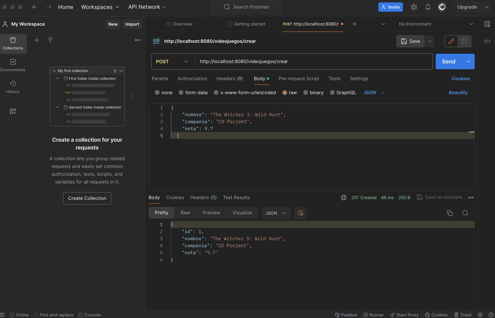
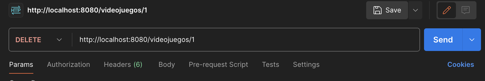
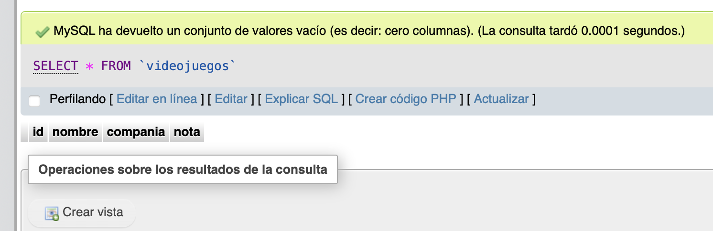
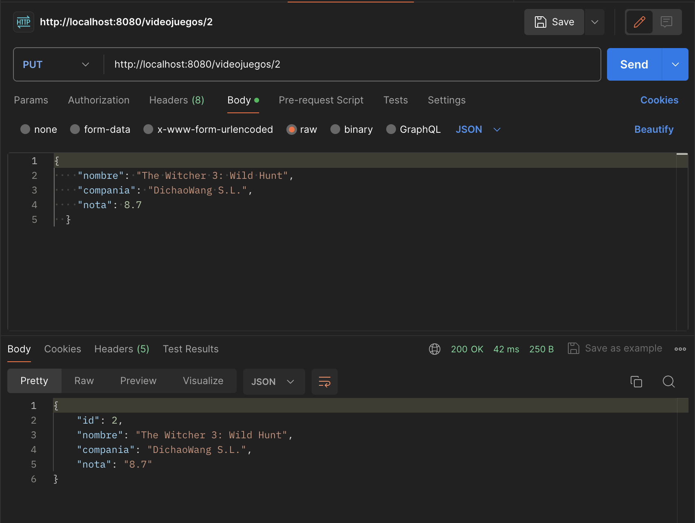
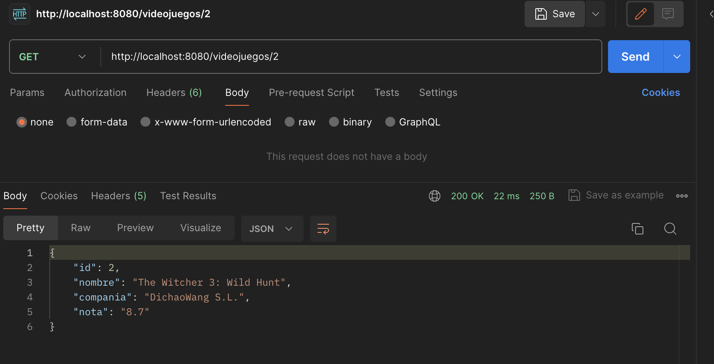
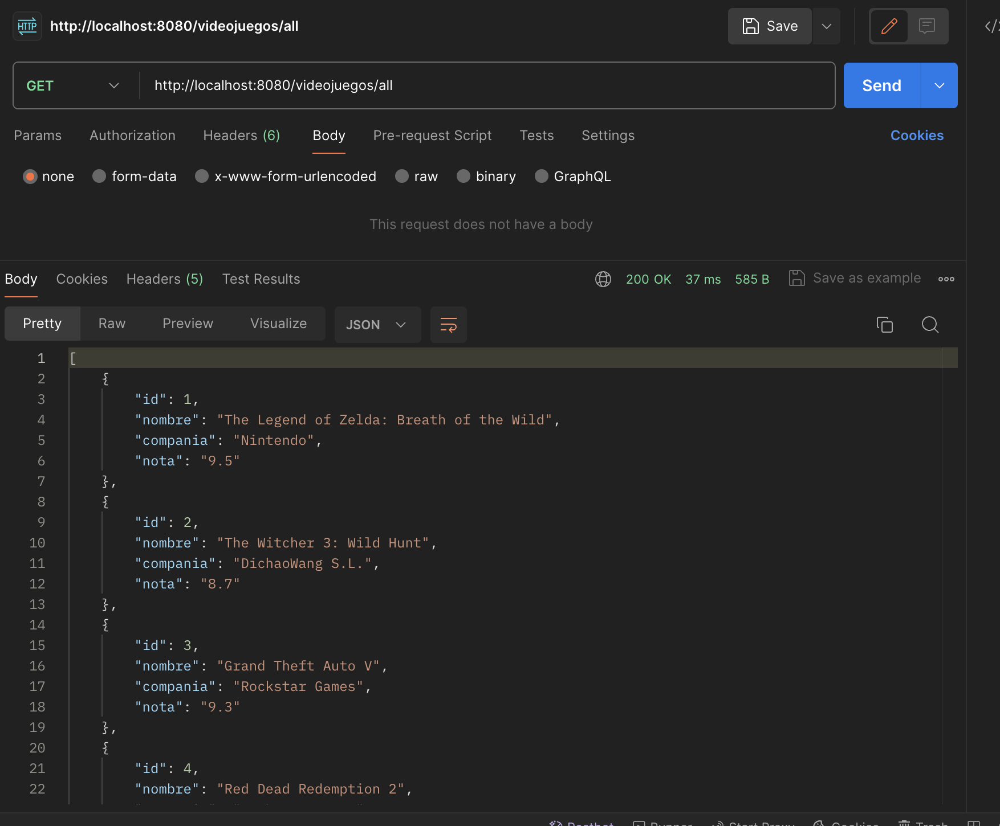
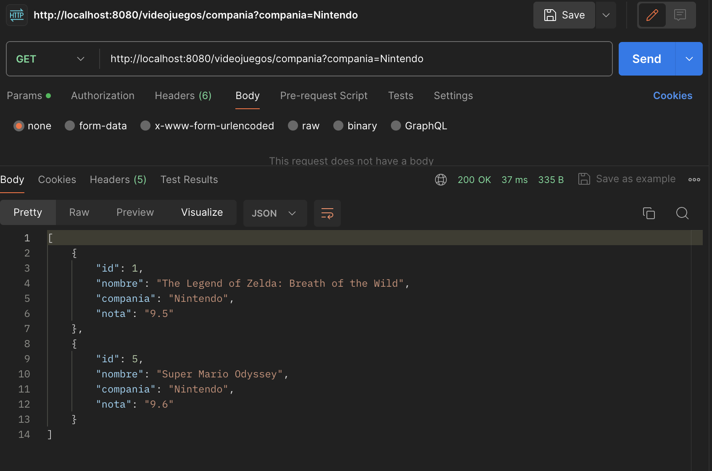

# Actividad 08 - Servicio REST

Se pide hacer un servicio REST, dicho servicio gestionará una serie de Videojuegos.
Los videojuegos tendrán un ID, un nombre, una compañía y una nota. Los videojuegos se encontrarán alojados en el servidor REST. Se recomiendo guardar los videojuegos en base de datos mediante JPA o Spring  JPA Data.
El servicio REST proporcionará un servicio CRUD completo, y podrá ser consumido mediante un cliente como Postman y todo el intercambio de mensajes se hará a través de JSON.
Además, se pide a través de Postman realizar las siguientes tareas y apreciar los resultados (poner las capturas en un fichero con los resultados):

- 1-Dar de alta un videojuego
- 2-Dar de baja un videojuego por ID
- 3-Modificar un videojuego por ID
- 4-Obtener un videojuego por ID
- 5-Listar todos los videojuegos
- 6-Listar todos los videojuegos por compañía

### Reglas de negocio:

No puede haber 2 videojuegos con el mismo nombre

No puede haber videojuegos con el nombre en blanco

Nota: Para hacer el proyecto en SpringBoot con JDBC se debe de importar los starters de MySql y de JDBC. Para hacerlo con Spring JPA data hay que importar este starter y el de MySQL.

---

# ➡️ Resolución ⬅️


🔴 1 Dar de alta un videojuego


Se debe de enviar un JSON con el siguiente formato:
```json
{
  "nombre": "The Witcher 3: Wild Hunt",
  "compania": "CD Projekt",
  "nota": 9.7
}
```
En el controlador:
> org/tareapsp/tareapsp2_1/controlador/ControladorVideojuegos.java

linea 20-29:
```java
 @PostMapping("/crear")
    public ResponseEntity<Videojuego> create(@RequestBody Videojuego videojuego) {
        if (videojuego.getNombre() == null || videojuego.getNombre().isEmpty()) {
            return new ResponseEntity<>(HttpStatus.BAD_REQUEST);
        }
        if (daoVideojuego.findByNombre(videojuego.getNombre()) != null) {
            return new ResponseEntity<>(HttpStatus.CONFLICT);
        }
        return new ResponseEntity<>(daoVideojuego.save(videojuego), HttpStatus.CREATED);
    }
```
En el postman, en la pestaña de body, seleccionar raw y en el desplegable seleccionar JSON.

Para que se pueda dar de alta un videojuego con un id autogenerado, en: 
> org/tareapsp/tareapsp2_1/modelo/entidad/Videojuego.java

linea 8-10: 

```java
    @Id
    @GeneratedValue(strategy = GenerationType.IDENTITY)
    private Long id;
```

y en mysql, en la tabla videojuego, el campo id debe de ser autoincremental.

```sql
CREATE TABLE videojuegos (
    id INT AUTO_INCREMENT PRIMARY KEY,
    nombre VARCHAR(100) NOT NULL,
    compania VARCHAR(100) NOT NULL,
    nota DECIMAL(2,1) NOT NULL
);
```
o para los que ya se ha creado la tabla, se puede hacer con el siguiente comando:
```sql
ALTER TABLE videojuegos MODIFY COLUMN id INT AUTO_INCREMENT;
```
---
🔴 2 Dar de baja un videojuego por ID





En el controlador:
> org/tareapsp/tareapsp2_1/controlador/ControladorVideojuegos.java

linea 52-59
```java
   @DeleteMapping("/{id}")
    public ResponseEntity<Void> delete(@PathVariable Long id) {
        if (!daoVideojuego.existsById(id)) {
            return new ResponseEntity<>(HttpStatus.NOT_FOUND);
        }
        daoVideojuego.deleteById(id);
        return new ResponseEntity<>(HttpStatus.NO_CONTENT);
    }
```

--- 
🔴 3-Modificar un videojuego por ID

En posdtman

> PUT http://localhost:8080/videojuegos/2

Se debe de enviar un JSON con el siguiente formato:
```json
{
  "nombre": "The Witcher 3: Wild Hunt",
  "compania": "DichaoWang S.L.",
  "nota": 8.7
}
```
En el controlador:

```java
@PutMapping("/{id}")
    public ResponseEntity<Videojuego> update(@PathVariable Long id, @RequestBody Videojuego videojuego) {
        Videojuego existingVideojuego = daoVideojuego.findById(id).orElse(null);
        if (existingVideojuego == null) {
            return new ResponseEntity<>(HttpStatus.NOT_FOUND);
        }
        existingVideojuego.setNombre(videojuego.getNombre());
        existingVideojuego.setCompania(videojuego.getCompania());
        existingVideojuego.setNota(videojuego.getNota());
        return new ResponseEntity<>(daoVideojuego.save(existingVideojuego), HttpStatus.OK);
    }
```

🔴 4-Obtener un videojuego por ID



En el controlador:

```java
@GetMapping("/{id}")
    public ResponseEntity<Videojuego> read(@PathVariable Long id) {
        Videojuego videojuego = daoVideojuego.findById(id).orElse(null);
        if (videojuego == null) {
            return new ResponseEntity<>(HttpStatus.NOT_FOUND);
        }
        return new ResponseEntity<>(videojuego, HttpStatus.OK);
    }
```

🔴 5-Listar todos los videojuegos



En el controlador:

```java
 @GetMapping("/all")
    public ResponseEntity<List<Videojuego>> getAll() {
        return new ResponseEntity<>(daoVideojuego.findAll(), HttpStatus.OK);
    }
```
🔴 6-Listar todos los videojuegos por compañía



En el controlador:

```java
@GetMapping("/compania")
    public ResponseEntity<List<Videojuego>> getAllByCompania(@RequestParam String compania) {
        return new ResponseEntity<>(daoVideojuego.findByCompania(compania), HttpStatus.OK);
    }
```
En el postman:

> GET http://localhost:8080/videojuegos/compania?compania=Nintendo


